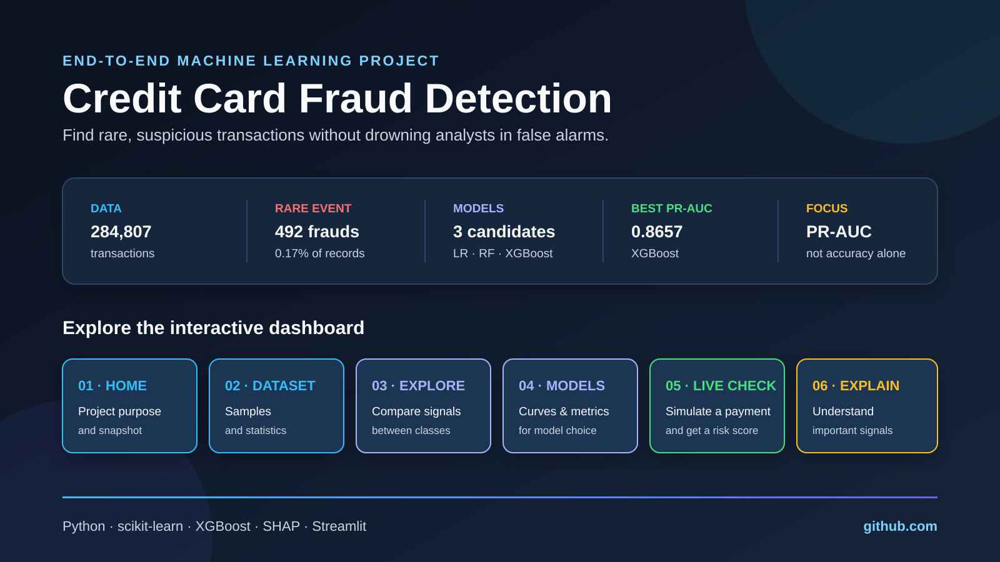

# Credit Card Fraud Detection - End-to-End ML Project

Binary classification on highly imbalanced credit card transaction data to
predict whether a transaction is fraudulent (1) or legitimate (0).



## Dashboard 

The Streamlit dashboard turns the complete machine learning workflow into one
interactive experience:

| Tab | Purpose |
|---|---|
| Home | Explains the project and summarizes the dataset and results |
| Dataset | Shows transaction samples and descriptive statistics |
| Explore Data | Compares legitimate and fraudulent behavior by feature |
| Models | Compares model metrics, ROC/PR curves, and confusion matrices |
| Live Check | Simulates a transaction and returns a fraud probability |
| Why It Decides | Displays SHAP and feature-importance explanations |

The `V1`-`V28` columns are anonymized PCA components from the original dataset.
The dashboard uses illustrative signal descriptions for readability; they are
not the original hidden business field names.

## Problem Statement

Fraudulent transactions make up only ~0.17% of all transactions, so the model
must catch rare fraud cases without drowning in false positives. Plain accuracy
is misleading here, so evaluation focuses on ROC-AUC, precision-recall AUC, and
recall on the fraud class.

## Dataset

- Source: [Kaggle - Credit Card Fraud Detection](https://www.kaggle.com/datasets/mlg-ulb/creditcardfraud)
- 284,807 transactions | 492 frauds | 30 features
- `Time`, `Amount`, and 28 PCA-transformed features (`V1`-`V28`)
- Target: `Class` (0 = legit, 1 = fraud)

Download the dataset and place it at `data/raw/creditcard.csv`.

### Dataset Details

The dataset contains real-world credit card transactions collected over two
days. Fraud is extremely rare: 492 of 284,807 transactions are labeled as
fraud, or approximately 0.17%. This imbalance is why the project reports
precision, recall, F1, ROC-AUC, and average precision instead of relying on
accuracy alone.

The original dataset does not reveal the business meaning of the `V1`-`V28`
columns. They are PCA-transformed numerical components created to protect
privacy. The names below are illustrative descriptions used by this project to
make the dashboard and README easier to understand; they are not the original
hidden field names.

### Feature Reference

| Column | Project display name | Description |
|---|---|---|
| `Time` | Transaction Time | Seconds elapsed since the first recorded transaction |
| `Amount` | Transaction Amount | Value of the transaction |
| `V1` | Spending Pattern A | Anonymized behavioral signal 1 |
| `V2` | Spending Pattern B | Anonymized behavioral signal 2 |
| `V3` | Customer Behavior Signal | Anonymized behavioral signal 3 |
| `V4` | Transaction Risk Signal | Anonymized behavioral signal 4 |
| `V5` | Purchase Behavior Signal | Anonymized behavioral signal 5 |
| `V6` | Transaction Context Signal | Anonymized behavioral signal 6 |
| `V7` | Account Behavior Score | Anonymized behavioral signal 7 |
| `V8` | Usage Pattern Signal | Anonymized behavioral signal 8 |
| `V9` | Transaction Frequency Signal | Anonymized behavioral signal 9 |
| `V10` | Location Anomaly | Anonymized behavioral signal 10 |
| `V11` | Account Activity Signal | Anonymized behavioral signal 11 |
| `V12` | Purchase Type Signal | Anonymized behavioral signal 12 |
| `V13` | Transaction Deviation Signal | Anonymized behavioral signal 13 |
| `V14` | Fraud Indicator (strongest) | Anonymized behavioral signal 14 |
| `V15` | Customer Pattern Signal | Anonymized behavioral signal 15 |
| `V16` | Payment Behavior Signal | Anonymized behavioral signal 16 |
| `V17` | Merchant Risk Signal | Anonymized behavioral signal 17 |
| `V18` | Transaction Timing Signal | Anonymized behavioral signal 18 |
| `V19` | Account Risk Signal | Anonymized behavioral signal 19 |
| `V20` | Spending Deviation Signal | Anonymized behavioral signal 20 |
| `V21` | Usage Consistency Signal | Anonymized behavioral signal 21 |
| `V22` | Transaction Pattern Signal | Anonymized behavioral signal 22 |
| `V23` | Merchant Behavior Signal | Anonymized behavioral signal 23 |
| `V24` | Location Behavior Signal | Anonymized behavioral signal 24 |
| `V25` | Payment Context Signal | Anonymized behavioral signal 25 |
| `V26` | Account Consistency Signal | Anonymized behavioral signal 26 |
| `V27` | Transaction Similarity Signal | Anonymized behavioral signal 27 |
| `V28` | Final Risk Signal | Anonymized behavioral signal 28 |

During preprocessing, the project also creates `Scaled_Amount`, `Hour`, and
`Log_Amount` for modeling. The original `Class` column remains the prediction
target and is not used as an input feature.

## Approach

1. EDA and feature engineering (scale `Amount`, extract `Hour`, `Log_Amount`)
2. Class imbalance handling via SMOTE + class weights
3. Model comparison: Logistic Regression, Random Forest, XGBoost
4. Evaluation: ROC-AUC, Precision-Recall, Confusion Matrix, SHAP
5. Interactive Streamlit dashboard

## Results

| Model               | Accuracy | F1     | ROC-AUC | Avg Precision |
|---------------------|----------|--------|---------|---------------|
| Logistic Regression | 0.9736   | 0.1071 | 0.9704  | 0.7246        |
| Random Forest       | 0.9991   | 0.7636 | 0.9838  | 0.8566        |
| XGBoost             | 0.9992   | 0.7778 | 0.9795  | 0.8657        |

_Metrics from the held-out test set (see `reports/model_comparison.csv`). XGBoost
has the best F1 and average precision; Random Forest edges it on ROC-AUC. On this
imbalanced data, average precision (PR-AUC) is the metric that matters most, so
XGBoost is the practical pick despite the tie at the top of the CV leaderboard._

## How to Run

```bash
pip install -r requirements.txt

# 1. Preprocess (creates data/processed/ + models/scaler.pkl)
python src/preprocess.py

# 2. Train all models (creates models/*.pkl)
python src/train.py

# 3. Evaluate + generate figures and comparison CSV
python src/evaluate.py

# 4. Launch the dashboard
streamlit run dashboard/app.py

# Optional: single-transaction prediction demo
python src/predict.py
```

Open the local URL printed by Streamlit, usually `http://localhost:8501`.

## Reproducibility

The preprocessing and training scripts use `random_state=42`. To rebuild the
processed data, models, evaluation report, and figures from a fresh checkout,
see [SETUP_ON_NEW_PC.md](SETUP_ON_NEW_PC.md).

## Project Structure

```
credit-card-fraud-detection/
├── data/
│   ├── raw/                 # creditcard.csv (not committed)
│   └── processed/           # train.csv, test.csv
├── notebooks/               # 01_eda, 02_preprocessing, 03_modeling, 04_evaluation
├── src/                     # preprocess, train, evaluate, predict
├── models/                  # *.pkl model + scaler artifacts
├── dashboard/app.py         # Streamlit app
├── reports/
│   ├── figures/             # saved plots
│   └── model_comparison.csv
├── requirements.txt
├── README.md
└── .gitignore
```

## Key Learnings

- Accuracy is misleading on imbalanced data - precision-recall AUC is the real metric.
- SMOTE combined with class weights gives strong recall without destroying precision.
- SHAP tends to surface `V14`, `V17`, and `V12` as the top fraud signals.

## Tech Stack

Python, scikit-learn, XGBoost, imbalanced-learn, SHAP, Streamlit, matplotlib,
seaborn, pandas, numpy.
